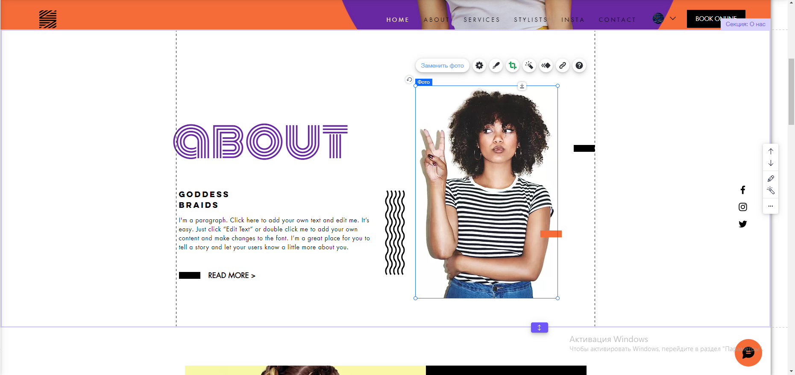

# Як створити сайт салону краси на wix
---
Спочатку нам потрібно зареєструватись на сайті. Далі ми повинні створити новий сайт, перший пункт з вибором категорії сайту ми пропускаємо. В наступному кроці пишемо назву сайту, далі обираємо функціонал сайту. Я пропоную обрати онлайн букінг сервісів, але ви можете обрати ще якісь функції. Після цього обираємо створити сайт по шаблону, нам підходить шаблон ["Салон краси"](https://ru.wix.com/website-template/view/html/2199?originUrl=https%3A%2F%2Fru.wix.com%2Fwebsite%2Ftemplates%3Fcriteria%3D%25D1%2581%25D0%25B0%25D0%25BB%25D0%25BE%25D0%25BD%2B%25D0%25BA%25D1%2580%25D0%25B0%25D1%2581%25D0%25BE%25D1%2582%25D1%258B&tpClick=view_button&esi=4bf5b99c-9e62-4e0a-83ec-5b2659a00a64). Обираємо його через пошук та тиснемо кнопку редагувати. У нас відкриється таке вікно:

---
# Як редагувати текст
---
Клікаємо на будь який текст і тиснемо редагувати

---
# Як заміняти фото
---
Клікаємо на фото і тиснемо замінити фото

---
## Таким чином змінюємо усі елементи сайту
---
# Інший Варіант - ми можемо використати швидке редаування секції
---
Для цього клікаємо на секцію і обираємо швидке редагування

В панелі зліва можна редагувати різні елементи

---
# Як редагувати меню
---
Клікаємо на меню і тиснемо налаштувати

---
# Як переключатись між сторінками
---

Клікаємо на вкладку меню і сторінки. 

Потім обираємо сторінку і переходимо на неї.

---
# Як змінити кольори
---
Тиснемо сюди:

І обираємо кольори:

---
# Як додати свої секції
---
Клікаємо на кнопку додати секцію

Обираємо секцію і додаємо її

---
# Як опублікувати сайт
---
Тиснемо кнопку опублікувати і обираємо безкоштовний домен

Далі нам видасть посилання на наш сайт

---
# Тепер наш сайт повністю готовий
---
## Сподіваюся мій туторіал був корисним!